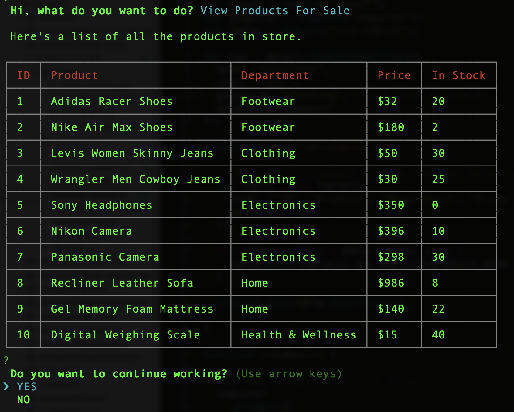

# Bamazon

## About this app

* Bamazon is an Amazon-like storefront created using Node.js and MySQL.

* It is a command line app.

* The app will take in orders from customers and deplete stock from the store's inventory.

* There are two files `bamazon_customer.js` and `bamazon_manager.js` which have a customer and manager view respectively.

## Video of the working of the App

* Click this [Youtube video](https://youtu.be/XngrMxbALGs) for a demo of the working of this app.

## Things to do before you start using the app

* Make sure you have [Node.js](https://nodejs.org/en/) and [MySql](https://dev.mysql.com/downloads/installer/) installed on your computer.

* After cloning/downloading this app's repository, go to your terminal and navigate to the folder of this app and run `npm init -y` to download the `package.json` file.

* Then, you'll need to install the following packages in the same folder. Without installing these packages, the app won't work on your computer.

	* [MySQL](https://www.npmjs.com/package/mysql)

		* `npm i mysql`

	* [Inquirer](https://www.npmjs.com/package/inquirer)

		* `npm i inquirer`

	* [CLI-Table 2](https://www.npmjs.com/package/cli-table2)

		* `npm i cli-table2`

## Instructions to use the app

* In your terminal/command line navigate to the folder of this app and type the following:

#### To start the Customer view, type this :

* `node bamazon_customer.js`
* This command will output the following:
	

* If sufficient quantity in stock then the following is shown:
	

* If insufficient quantity in stock then the following is shown:
	

* If out of stock then the following is shown:
	

#### To start the Manager view, type this :

* `node bamazon_manager.js`
* This command will output the following:
	

* `View Products For Sale`
	

* `View Low Inventory`
	

* `Add to Inventory`
	

* `Add New Product`
	

